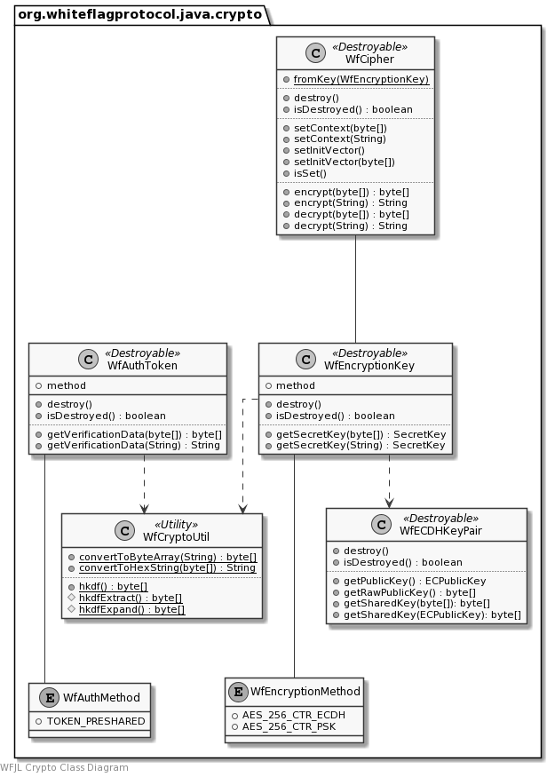

# WFJL Whiteflag Messages

Go back to the [WFJL Documentation Home](../index.md) or visit
the detailed [WFJL Javadoc API Reference](../javadoc)

## Overview

This section describes how Whiteflag cryptographic functions are implemented
internally by the WFJL. The `WfMessage` class uses these classes and methods
to encrypt and decrypt messages. Classes that implement the `WfAccount`
interface require to reference some of the cryptographic classes,
such as `WfEncryptionKey`, `WfECDHKeyPair`, `WfECDHPublicKey` and
`WfAuthToken`.

### Example

A simplified piece of code to encrypt some data with the one of the Whiteflag
encryption methods may look like this:

```java
import org.whiteflagprotocol.java.WfCipher;
import org.whiteflagprotocol.java.WfEncryptionKey;

public class Example {
  public byte[] encryptData(WfEncryptionKey key, byte[] data, byte[] context) {
    WfCipher cipher = WfCipher.fromKey(key);
    byte[] iv = cipher.setContext(context).setInitVector();
    byte[] ciphertext = cipher.encrypt(data);
    cipher.destroy();
  }
}
```

### Class Diagram

The class diagram gives a rough overview of the package. It is not intended as
a complete or accurate reference for the classes. Instead, please see the
[WFJL Javadoc API Reference](../javadoc) for all details.




## Detailed Implementation

### General

Whiteflag message mostly uses hexadecimal representations for binary data.
Most cryptographic functions, on the other hand, operate on byte arrays.
Therefore, the `WfCryptoUtil` utility class provides functions to convert
hexadecimal strings to byte arrays and vice versa:

```java
String hexString = WfCryptoUtil.convertToHexString(byteArray);
byte[] byteArray = WfCryptoUtil.convertToByteArray(hexString);
``` 

Whiteflag crypto classes perform the conversion automatically with
overloaded methods. Hoewever, where possible, it is prefered to represent and
pass cryptographic data as a as a class insted of a byte array to ensure type
safety, e.g. WfEncryptionKey, ECPublicKey, WfAuthToken, etc.

Some classes implement the `javax.security.auth.Destroyable` interface, to
clear thier contents by calling the `destroy()` method:
`WfEncryptionKey`, `WfCipher` and `WfECDHKeyPair`. Subsequent calls to methods
of these objects will cause an `IllegalStateException`.

### Encryption methods

The Whiteflag specification defines encryption methods. These methods describe
how the encryption of Whiteflag message is performed. The parameters for these
methods (e.g. algortihm, mode, key length) are defined for the WFJL in the
`WfEncryptionMethod` enum class. Currently two methods are implemented:

- Method 1: AES in Counter Mode (CTR) with a 256 bit negotiated key
- Method 2: AES in Counter Mode (CTR) with a 256 bit pre-shared key

The `WfEncryptionKey` class represents a master encryption key. The key is
created from raw key material and bound to one of the encyrption methods upon
creation. The raw key material can be provided as a hexadecimal string or a
byte array.

The `WfCipher` class performs the encryption of data. An instance of the cipher
is created with a static factory method that is given the encryption key. Since
the key is bound to an encryption method, the cipher initialises itself upon
creation.

Before data can be encrypted or decrypted, the cipher needs an
random but not secret initialisation vector to operate in counter mode. This
vector can be randomly generated (for a new encryption) or be provided (for
decryption). Whiteflag shares these initialisation vectors for encryption
methods 1 and 2 respectively with `K11` and `K12` messages referencing
the encrypted message.

Furthermore, "context information" must be provided to derrive
and bind the actual encryption key. In accordance with the Whiteflag
specification this is the address of the blockchain account sending the
encrypted message. In accordance with the Whiteflag specification, the actual
encryption keys are derrived using the RFC 5869 HKDF, which is implemented by
the `WfCryptoUtil` class.

## Key negotiation

Whiteflag uses Elliptic Curve Diffie-Hellman (ECDH) over the blockchain to
negotiate a key fo encryption method 1. The `WfECDHKeyPair` class represents
a key pair for the RFC 5639 `brainpoolP256R1` curve for use by Whiteflag. The
raw ECDH public keys are shared on the blockchain using Whiteflag `K0A`
cryptographic support messages, so that others can calculate the shared secret
and create an encryption key.

```java
// Prepare K0A message with raw ECDH public key in CryptoData field
WfECDHKeyPair ownKeyPair = new WfECDHKeyPair();
byte[] ownPublicKey = ownKeyPair.getRawPublicKey();
wfMessageK0A.set("CryptoData", wfCryptoUtil.convertToHexString(ownPublicKey));
```

To create a shared encryption key from a received ECDH public key, create 
a new `WfEncryptionKey` by provding the received public key and you own
`WfECDHKeyPair` key pair to the constructor:

```java
// Received K0A message with raw ECDH public key in CryptoData field
String receivedPublicKey = wfMessageK0A.get("CryptoData");
WfEncryptionKey negotiatedKey = new WfEncryptionKey(receivedPublicKey, ownKeyPair);
```

## Authentication

The Whiteflag specification defines multip[le authentication methods. One of
these methods uses a pre-shared secret for authentication. The `WfAuthToken`
class represents such a pre-shared secret. The class generates the proof of
possession (and identity) that can be used in a Whiteflag `A2` authentication
message.

```java
// Prepare A2 message with proof of possession in VerificationData field
String context = ownBlockchainAddress;
WfAuthToken authToken = new WfAuthToken(someSharedSecret);
wfMessageA2.set("VerificationData", authToken.getVerificationData(context));
```
