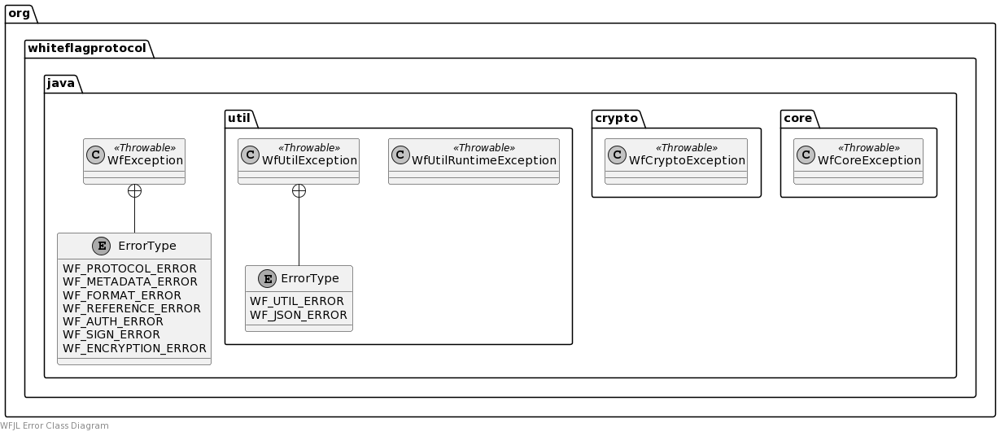

# Whiteflag Java Library

Go back to the [WFJL Documentation Home](../index.md) or visit
the detailed [WFJL Javadoc API Reference](../javadoc/index.html)

## Error Handling

### Overview

In addition to the standard Java exception classes, the WFJL extends the
[Java Exception class](https://docs.oracle.com/javase/8/docs/api/java/lang/Exception.html)
for Whiteflag specific errors:

* `WfException`: used by the `org.whiteflag.protocol` to indicate errors to other software components while processing WHiteflag data
* `WfCoreException`: used internally by the `org.whiteflag.protocol.core` package for incompatibilities with the Whiteflag specification
* `WfUtilException`: used internally by the `org.whiteflag.protocol.util` package to wrap error thrown by other packages

Software using the library should only expect the `WfException` class to be
thrown, and should only use that class. The `WfCoreException` and
`WfUtilException` classes are only used internally.

### Detailed Implementation

#### Error Class Diagram



#### Error Classes

The core package defines the `WfCoreException` class, that is thrown by its
classes if any request is made that is not in accordance with the Whiteflag
specification, e.g. when a field value is not allowed or is not correctly
formatted for a specfic field.

The main package `org.whiteflag.protocol` that provides the external interface,
uses the `WfExcepetion` class that extends the `WfCoreException` class. The
`WfException` class has a property indicating the type of error. The error
types are defined by the nested enumeration `WfException.ErrorType`.

#### Error Types

The `WfException.ErrorType` enum defines the following error codes:

* `WF_GENERIC_ERROR`: generic Whiteflag error
* `WF_METADATA_ERROR`: incorrect or missing Whiteflag message metadata
* `WF_FORMAT_ERROR`: Whiteflag message format error
* `WF_REFERENCE_ERROR`: Whiteflag message reference error
* `WF_AUTH_ERROR`: Whiteflag message authentication error
* `WF_SIGN_ERROR`: Whiteflag signature error
* `WF_ENCRYPTION_ERROR`: Whiteflag encryption error

### Usage

#### Example

An example where a Whiteflag exception is thrown during authentication
of an originator:

```java
throw new WfException("Invalid authenticated data", WfException.ErrorType.WF_AUTH_ERROR);
```
