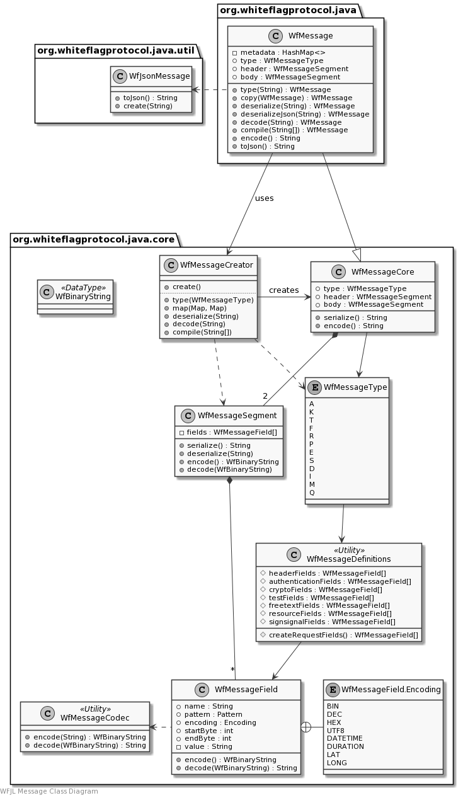

# WFJL Whiteflag Messages

Go back to the [WFJL Documentation Home](../index.md) or visit
the detailed [WFJL Javadoc API Reference](../javadoc)

## Overview

This section describes how Whiteflag messages are implemented internally
by the WFJL. To use Whiteflag messages in software applications, only the
`org.whiteflagprotocol.java` package with the `WfMessage` class should be
required normally.

In addition, the `WfBinaryBuffer` from the `org.whiteflagprotocol.java.core`
may be used if working with binary encoded message, but the `WfMessage` class
does provide methods to obtain binary encoded messages as byte arrays or
hexadecimal strings. 

### Example

A simplified example for creating a new Whiteflag message of a type specified
by a string with the message code:

```java
import org.whiteflagprotocol.java.WfMessage;
import org.whiteflagprotocol.java.WfException;

public class Example {
  /* Properties */
  private WfMessage message;

  /* Methods */
  public WfMessage createMessage(String messageType) throws WfException {
    message = WfMessage.type(messageType);
    return message;
  }
}
```

### Class Diagram

The class diagram gives a rough overview of the package. It is not intended as
a complete or accurate reference for the classes. Instead, please see the
[WFJL Javadoc API Reference](../javadoc) for all details.



## Detailed Implementation

### Message Classes

The WFJL implements the Whiteflag messages defined in the Whiteflag standard
with the `WfMessage` class of the `org.whiteflagprotocol.java` package. This class
encapsulates the `WfBasicMessage` class from the `org.whiteflagprotocol.java.core`
package and adds implementation-sepcific metadata and methods that allow
for further integration in larger software applications.

### Message Core, Segment and Field classes

The `WfBasicMessage` class only contains the elements as specified in the
Whiteflag standard, i.e. the generic message header and the message type
specific body. Both are implemented as a `WfMessageSegment` class, which
comprises a number of message fields implemented as `WfMessageField` class.

### Message Creator, Type and Definition classes

To create Whiteflag messages, the core package provides the `WfMessageCreator`
class to instantiate `WfBasicMessage` objects. The `WfMessageCreator` class is
used by the static factory methods of the `WfMessage` class, which are the
external interface to other software to create Whiteflag messages.

The `WfMessageType` class contains all message types i.a.w. the Whiteflag
specification, and is used by the `WfMessageCreator` class to create the
messages. The `WfMessageDefintions` is a utility class with all field
definitions.

## Usage

### Message Creation and Alteration

The `WfMessage` class represents a Whiteflag message. The class cannot be
instantiated directly. Instead, one of its static factory methods must be used
to create a message. The available static factory methods to do this are:

* `WfMessage.type(String messageCode)`: creates a new Whiteflag message of the type specified by the message code with empty field values
* `WfMessage.copy(WfMessage)`: copies an existing Whiteflag message, without the metadata
* `WfMessage.clone(WfMessage)`: clones an existing Whiteflag message, including the metadata
* `WfMessage.deserialize(String)`: deserializes a string with a serialized message
* `WfMessage.deserializeJson(String)`: deserializes a string with a JSON representation of a message
* `WfMessage.decode(String)`: decodes a string with the hexadecimal representation of an unencrypted encoded message
* `WfMessage.compile(String[])`: compiles a Whiteflag message from an array with a complete and ordered set of field values

Each of these methods returns a new `WfMessage` object.

### Message Encryption and Decryption

Message encryption and decrytion requires additional information about the
originator and recipient of the message. The encryption method is determined
by the `EncryptionIndicator` field in the message itself.

For encryption, the orginator and recipient information is provided by passing
account information from objects implementing the `WfAccount` interface through
the following methods:

* `WfMessage.setOriginator(WfAccount originator)`: sets the originator of the message
* `WfMessage.setRecipient(WfAccount recipient)`: sets the recipient of the message
* `WfMessage.encode()` or `WfMessage.encrypt()`: are identical and return the binary encoded message (encrypted if the `EncryptionIndicator` field is set)
* `WfMessage.encode().toByteArray()`: returns the binary encoded/encrypted message as a byte array
* `WfMessage.getInitVector()`: returns the non-secret initialisation vector that is randomly created upon encryption

The non-secret initialisation vector is randomly created upon encryption, is
required for decryption. It is to be sent over the blockchain `K0A` Whiteflag
message. For decryption, all the information must be passed directly to the
static factory method:

* `WfMessage.decrypt(byte[] encryptedMsg, WfAccount originator, WfAccount recipient, byte[] initVector)`

### Accessing Message Fields

Message fields can be accessed through the getters and setter methods of the
`WfMessage` class and the fieldname:

* `WfMessage.set(String fieldname, String value)`: sets the value of the specified message field
* `WfMessage.get(String fieldname)`: returns the value of the specified message field

To ensure data integrity, a field value cannot change once set. The `set`
methods returns `true` if the field value is set. If the return value is
`false`, then the field value could not be set, either because the provided
value is invalid, or the field had already been set.

See below for a number of methods to check message and field validity. Trying
to serialize or encode an invalid message will result in a `WfException`
of type `WF_FORMAT_ERROR` to be thrown.

### Field Data and Validators

To support of message creation by application software, the following methods
are available:

* `WfMessage.isValid()`: returns a Boolean to indicate if the message is valid, i.e. if all message fields contain valid data
* `WfMessage.isValid(String fieldname)`: returns a Boolean to indicate if specified field contains valid data
* `WfMessage.isValid(String fieldname, String data)`: returns a Boolean to indicate if specified data would be valid for the specified field
* `WfMessage.getNoFields()`: returns an interger with the number of fields
* `WfMessage.getFieldNames()`: returns a Set with all field names

### Accessing Message Msetadata

The Whiteflag message object also holds the metadata associated with the
message. The metatdata may be accessed with the following methods:

* `WfMessage.addMetadata(String key, String value)`: sets the value if the key does not yet exist, otherwise it returns the existing value
* `WfMessage.getMetadata(String key)`: returns a String with the value of the provided key
* `WfMessage.getMetadataKeys()`: returns a Set of Strings with all existing metadata keys

As described, a metadata field cannot be changed once added.
