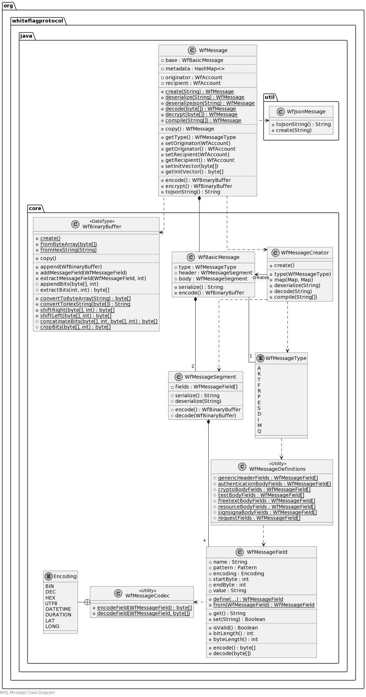

# Whiteflag Java Library

## Whiteflag messages

This section describes how Whiteflag messages are implemented by the WFJL.

For implementation in other software applications, only the
`org.whiteflag.protocol` package with the `WfMessage` class and its nested
creator class `WfMessage.Creator` are required. Both are described in the next
section.

The full implementation with all classes used to build and process Whiteflag
messages is shown and described in more detail below. For the detailed
documentation of Whiteflag programming interface, please see the
[WFJL API Documentation](../javadoc/index.html).

### Message creation and alteration

The `WfMessage` class represents a Whiteflag message. The class cannot be
instantiated directly. Instead, one of the methods from its nested static
`WfMessage.Creator` class must be used to create a message. The available
methods to do this are:

* `WfMessage.Creator.type(String messageCode)`: creates a new Whiteflag message of the type specified by the message code with empty field values
* `WfMessage.Creator.copy(WfMessage)`: copies an existing Whiteflag message, including the metadata
* `WfMessage.Creator.deserialize(String)`: deserializes a string with a serialized message
* `WfMessage.Creator.decode(String)`: decodes a string with the hexadecimal representation of an encoded message
* `WfMessage.Creator.compile(String[])`: compiles a Whiteflag message from an array with a complete and ordered set of field values

Each of these methods returns a new `WfMessage` object. This object contains
the message header and body as `WfMessageSegment` objects, which contain the
`WfMessageField` objects.

### Accessing message fields

Message fields are accessed through the message header or body segments. There
are a number of methods available to interact with the message fields, but the

* `WfMessage.body.getFieldValue(String name)`: returns the value of the specified message body field
* `WfMessage.body.setFieldValue(String name, String value)`: sets the value of the specified message body field

To ensure data integrity, a field value cannot change once set.

### Accessing message metadata

The message object also holds the metadata associated with the message. The
metatdata may be accessed with the following methods:

* `WfMessage.addMetadata(String key, String value)`: sets the value if the key does not yet exist, otherwise it returns the existing value
* `WfMessage.getMetadata(String key)`: returns a String with the value of the provided key
* `WfMessage.getMetadataKeys()`: returns a Set of Strings with all existing metadata keys

As described, a metadata field cannot be changed once added.

### Detailed implementation

#### Message Class Diagram

#### Message classes

The WFJL implements the Whiteflag messages defined in the Whiteflag standard
with the `WfMessage` class of the `org.whiteflag.protocol` package. This class
extends the `WfMessageCore` class from the `org.whiteflag.protocol.core`
package with additional implementation-sepcific metadata and methods that allow
for further integration in larger software applications.

#### Message core, segment and field classes

The `WfMessageCore` class only contains the core elements as specified in the
Whiteflag standard, i.e. the generic message header and the message type
specific body. Both are implemented as a `WfMessageSegment` class, which
comprises a number of message fields implemented as `WfMessageField` class.

#### Message creator and definition classes

To create Whiteflag messages, creator classes are used: the `WfMessageCreator`
class creates `WfMessageCore` objects and is instantiated by the nested
`WfMessage.Creator` class to created extended `WfMessage` objects.

The `WfMessageType` class contains all message types i.a.w. the Whiteflag
specification, and is used by the `WfMessageCreator` class to create the
messages. The `WfMessageDefintions` is a utility class wtih all field
definitions.
