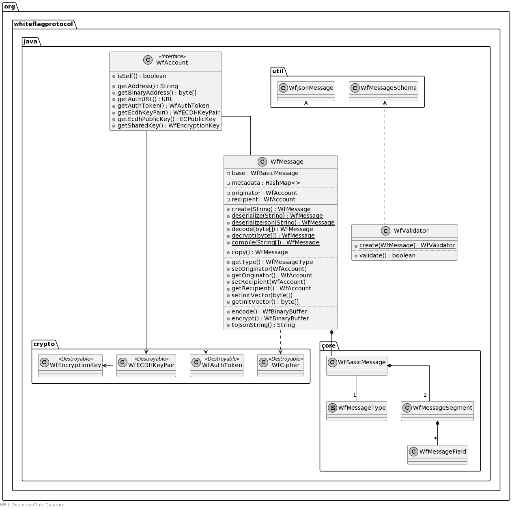

# WFJL Whiteflag Messages

Go back to the [WFJL Documentation Home](../index.md) or visit
the detailed [WFJL Javadoc API Reference](../javadoc)

## Overview

This section gives a general overview of the external programming interface
of the WFJL of the main `org.whiteflagprotocol.java` package. This package
defines:

* the `WfMessage` class, representing a Whiteflag message with its operations
  (e.g. encoding, encryption, decoding, decryption etc.).

* the `WfAccount` interface, defining how a class representing a Whiteflag
  account must interact with WFJL classes. As Whiteflag does not require a
  central user regitsration, such a Whiteflag account is merely an abstraction
  that bind Whiteflag specific attributes to a blockchain address.
  
Whiteflag participants are originators and recipients of Whiteflag messages,
which may be (groups of) organisations and individuals. As described in the
[Whiteflag specification](https://standard.whiteflagprotocol.org), participants
may use multiple Whiteflag accounts that correspond with a blockchain address
on the underlying blockchain. A Whiteflag account then binds Whiteflag specific
attributes, such as authentication data and encryption keys, to that blockchain
address.
### Example

A simplified example for creating a new Whiteflag message of a type specified
by a string with the message code:

```java
import org.whiteflagprotocol.java.WfMessage;
import org.whiteflagprotocol.java.WfException;

public class Example {
  /* Properties */
  private WfMessage message;

  /* Methods */
  public WfMessage decode(String hexString) throws WfException {
    message = WfMessage.decode(hexString);
    return message;
  }
}
```

### Class Diagram

The class diagram gives a rough overview of the package. It is not intended as
a complete or accurate reference for the classes. Instead, please see the
[WFJL Javadoc API Reference](../javadoc) for all details.


