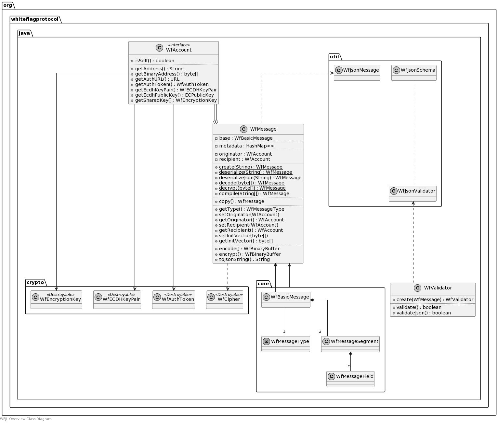

# WFJL Whiteflag Messages

Go back to the [WFJL Documentation Home](../index.md) or visit
the detailed [WFJL Javadoc API Reference](../javadoc)

## Overview

This section gives a general overview of the external programming interface
of the WFJL of the main `org.whiteflagprotocol.java` package. This package
defines:

* the `WfMessage` class, representing a Whiteflag message with its operations
  (e.g. encoding, encryption, decoding, decryption).

* the `WfParticipant` interface, defining how an organisation, department,
  individual, or any grouping thereof must be represented. All these sorts of
  participant typically have one or more attributes such as a blockchain
  addresses, authentication information and encryption keys. This interface
  defines how these attributes are provided to instances of WFJL classes
  such as a `WfMessage`.

### Example

A simplified example for creating a new Whiteflag message of a type specified
by a string with the message code:

```java
import org.whiteflagprotocol.java.WfMessage;
import org.whiteflagprotocol.java.WfException;

public class Example {
  /* Properties */
  private WfMessage message;

  /* Methods */
  public WfMessage decode(String hexString) throws WfException {
    message = WfMessage.decode(hexString);
    return message;
  }
}
```

### Class Diagram

The class diagram gives a rough overview of the package. It is not intended as
a complete or accurate reference for the classes. Instead, please see the
[WFJL Javadoc API Reference](../javadoc) for all details.


